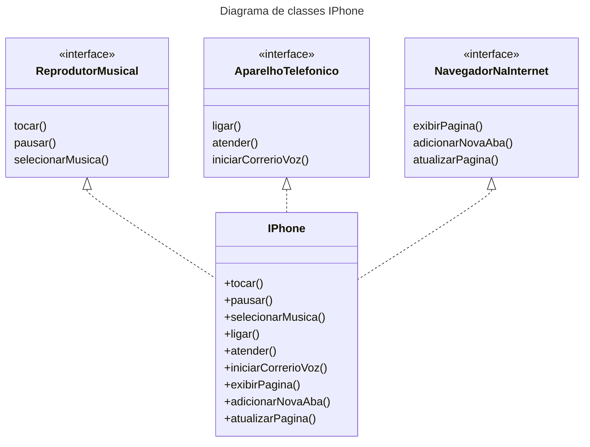

# Diagrama de classes UML

```mermaid
---
title: Diagrama de classes IPhone
---
classDiagram
    ReprodutorMusical <|.. IPhone
    AparelhoTelefonico <|.. IPhone
    NavegadorNaInternet <|.. IPhone

    class IPhone {
        +tocar()
        +pausar()
        +selecionarMusica()
        +ligar()
        +atender()
        +iniciarCorrerioVoz()
        +exibirPagina()
        +adicionarNovaAba()
        +atualizarPagina()
    }

    class ReprodutorMusical {
        <<interface>>
        tocar()
        pausar()
        selecionarMusica()
    }


    class AparelhoTelefonico {
        <<interface>>   
        ligar()
        atender()
        iniciarCorrerioVoz()
    }

    class NavegadorNaInternet {
        <<interface>> 
        exibirPagina()
        adicionarNovaAba()
        atualizarPagina()
    }

```
